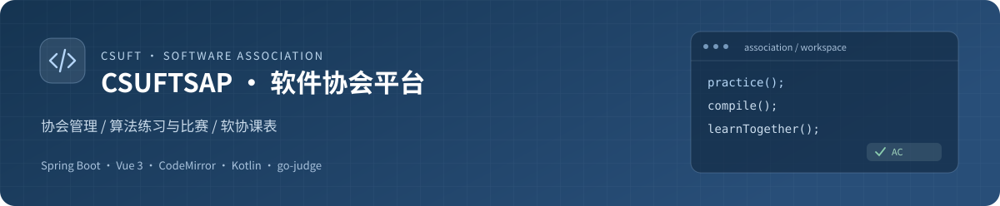
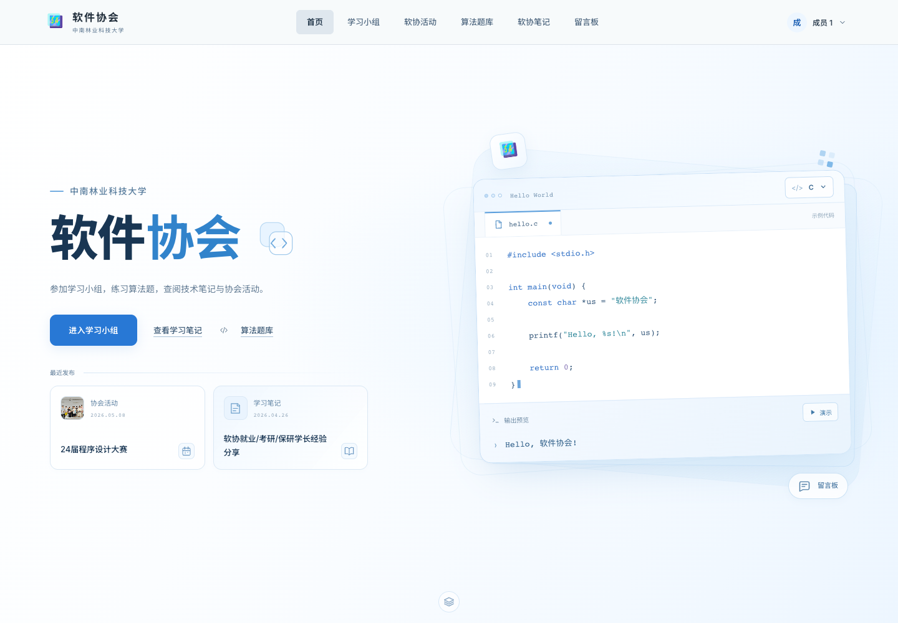
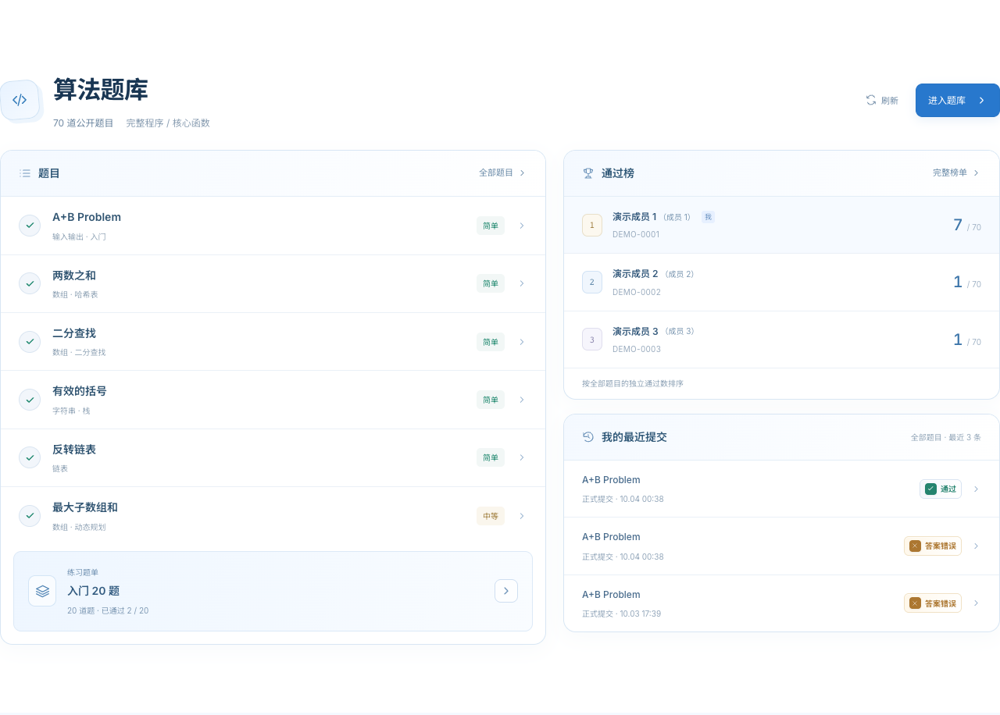
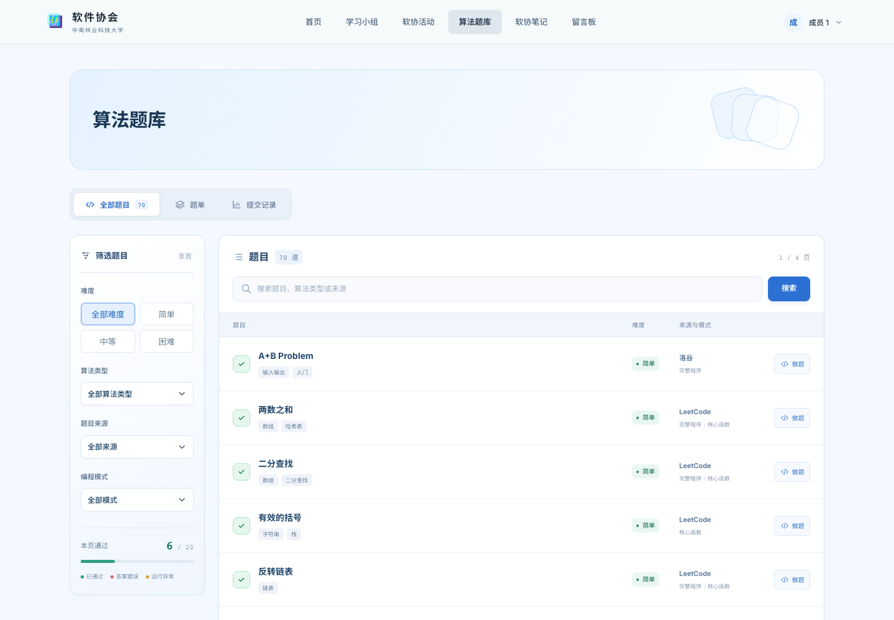
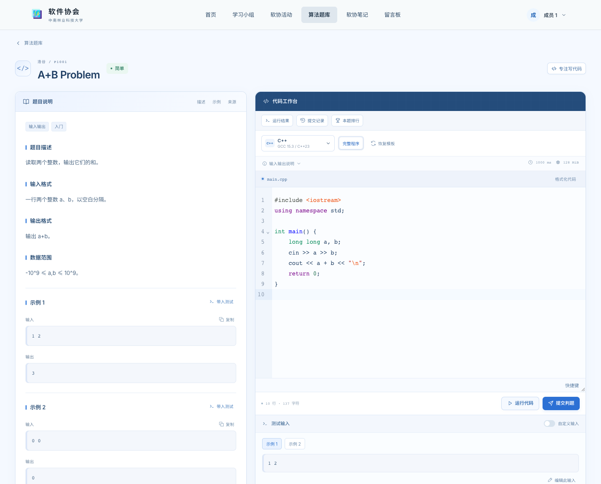
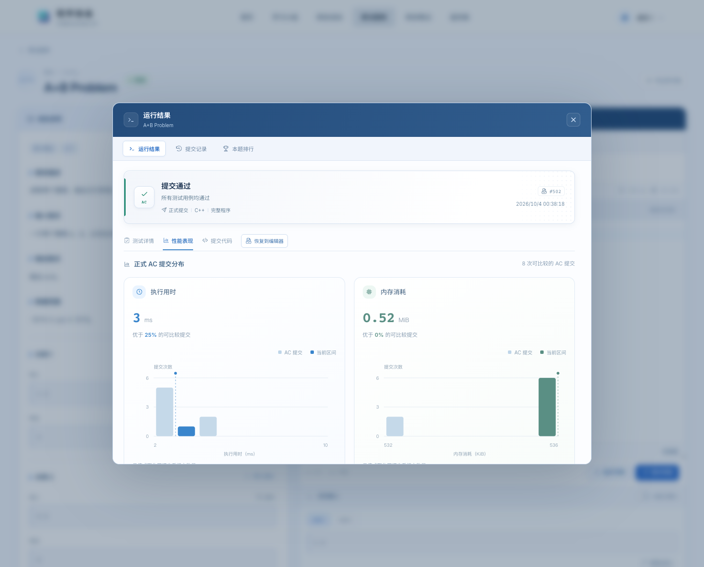
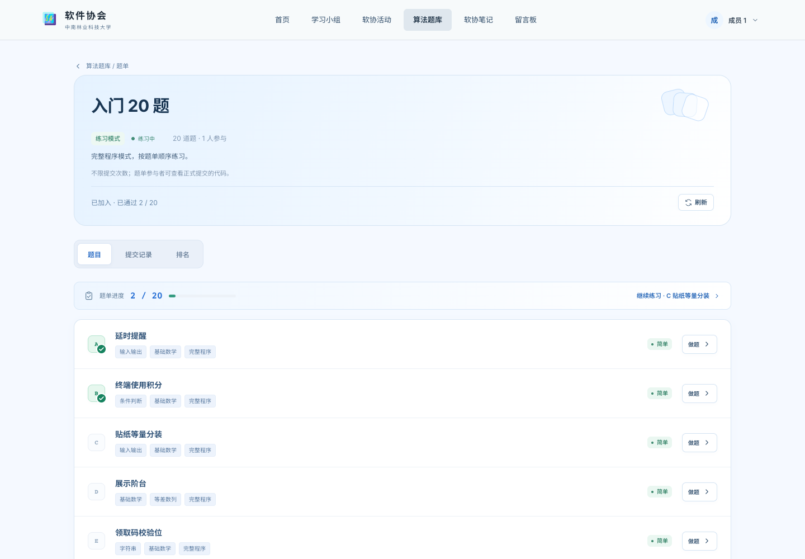
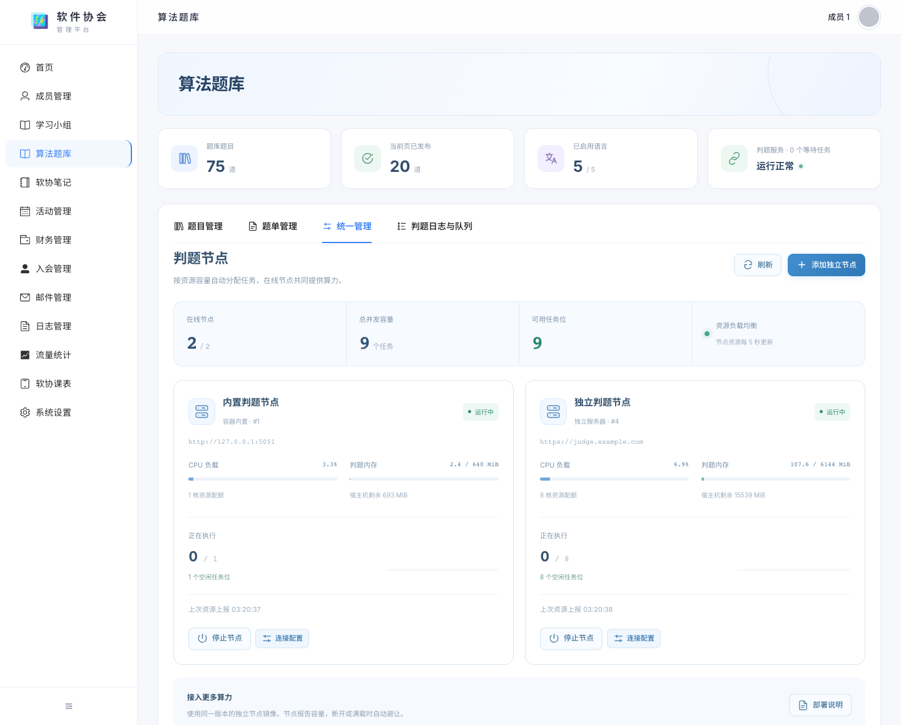
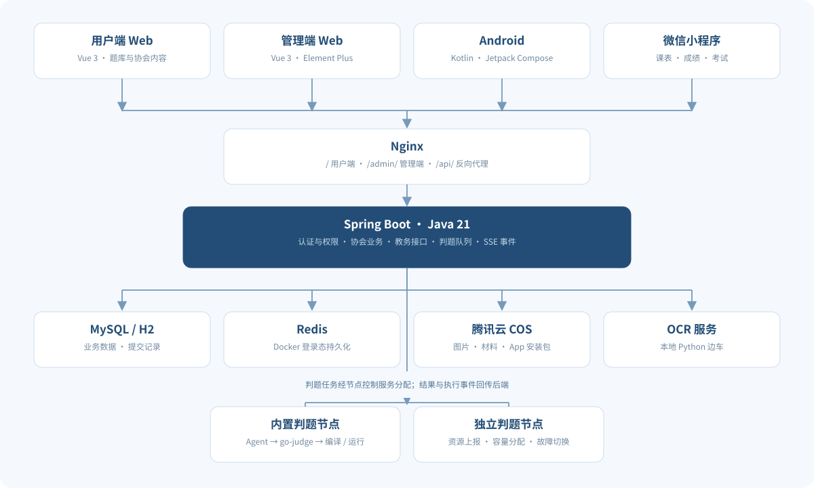

<p align="center">
  
</p>

<p align="center">
  <a href="https://csuftsap.top">在线平台</a> ·
  <a href="https://hub.docker.com/r/pllysun/sap">Docker 镜像</a> ·
  <a href="APP_BUILD_RELEASE.md">Android 构建与发布</a> ·
  <a href="LICENSE">MIT License</a>
</p>

CSUFTSAP 是中南林业科技大学软件协会的管理与学习平台。用户端提供协会内容、学习小组、算法练习和比赛；管理端维护成员、活动、题库、判题节点及运营数据。Android App 与微信小程序复用后端教务接口，提供课表、成绩和考试查询。

本文按当前项目与已部署的 Web 界面整理。截图中的个人账号、学号与独立判题服务器地址已替换为演示信息；界面布局、功能入口和交互来自实际页面。

**导航：** [界面与使用流程](#screenshots) · [功能](#features) · [技术与架构](#architecture) · [本地开发](#development) · [Docker 部署](#deployment) · [目录结构](#structure) · [文档与贡献](#contributing) · [许可证](#license)

<a id="screenshots"></a>

##  界面与使用流程

### 首页：从协会动态进入学习与算法练习

首页展示协会介绍、活动与笔记入口、学习方向、平台统计和荣誉成员。荣誉成员桌面每页展示两行、每行四人，支持翻页；窄屏自动调整列数。



首页算法区汇集题目预览、练习题单、通过榜和当前账号的最近提交。点击题目进入编辑器，点击提交记录直接查看该次结果。



### 题库：筛选题目，再查看个人状态

题库按「全部题目 → 题单 → 提交记录」组织。全部题目使用列表，支持关键词、难度、算法类型、来源及完整程序／核心函数筛选；展示顺序由管理端维护。

个人状态分别记录于普通题库和每个题单。正式提交通过后保留 AC 标记；样例运行不计入正式通过数。



### 工作台：读题、编写代码、运行样例与提交判题

左侧是题面、输入输出要求、约束与公开样例，右侧是代码编辑器和测试输入。支持 C、C++、Java、Python、Rust，以及题目所允许的完整程序或核心函数模式。

编辑器提供语法高亮、浏览器内代码补全与分析、格式化、搜索、快捷键和本地草稿。编译与执行在服务器判题沙箱中完成，前端通过异步事件展示入队、编译、逐例运行和最终结果。



运行结果、个人提交记录与排行使用固定尺寸弹窗。通过记录可查看耗时、内存和性能分布；正式提交的隐藏测试只展示判定与统计。历史提交可查看代码，也可主动恢复到编辑器继续修改。



### 题单：练习进度与比赛排名独立计算

题单组合已有题目，提供题目列表、提交记录、独立排名和完成情况。当前公开练习题单包含软件协会原创的 20 道入门题。



| 模式 | 时间与提交 | 排名与代码查看 |
| --- | --- | --- |
| 练习 | 无比赛时间限制，可反复提交；仍受队列与账号并发限制 | 按本题单的正式 AC 统计进度，参与者可查看题单内正式提交代码 |
| 比赛 | 管理员设置开始、结束时间和参赛范围，开赛前报名，截止后拒绝新提交 | 采用 ACM 通过题数与罚时排名；赛后是否公开代码由管理员决定 |

比赛在全部在线节点忙碌时接受有界排队，按服务器接收时间判断是否在截止前提交。截止前已接收的任务可在截止后完成；所有节点离线时返回资源不可用错误。比赛专用题可保持仅管理端可见，通过比赛题单控制访问。

### 管理端：题目维护与判题资源统一管理

管理端算法题库提供题目管理、题单管理、统一管理和判题运行记录。题目保存后先作为草稿，完成启用语言与模式的三轮测试验证后才能发布；管理员可调整题目展示顺序。

判题节点支持内置节点与独立服务器接入，展示在线状态、CPU、内存、并发容量及空闲任务位。运行记录按任务聚合，详情可查看提交代码、入队时间、执行阶段与错误。



<a id="features"></a>

##  功能

| 范围 | 已实现的主要功能 |
| --- | --- |
| 协会首页 | 协会介绍、最新内容、学习方向、统计与活跃图、荣誉成员、算法题库入口 |
| 成员与入会 | 成员和届别管理、角色分配、入会申请与审核、个人信息、注册防护 |
| 协会内容 | 活动与图片、Markdown 笔记、材料分享、留言与回复 |
| 学习小组 | 小组与课题、学习任务、成员参与、材料、成绩与排名 |
| 财务 | 收支记录、账单和凭证管理 |
| 算法题库 | 多语言编辑器、两种代码模式、题目筛选与排序、异步判题、个人记录与 AC 状态、性能图表和排行 |
| 题单与比赛 | 有序组合题目、练习与比赛模式、报名范围、时间控制、独立进度、ACM 罚时、代码公开策略 |
| 判题运维 | 节点接入与启停、资源上报、容量分配、故障切换、队列监测、任务时间线与源码查看 |
| 系统运营 | 系统设置、腾讯云 COS、邮件管理、操作日志、接口统计与流量分析 |
| 软协课表 | 教务账号绑定、多账号与多学期课表、成绩、考试、App 版本发布；Android 另含桌面小组件等原生功能 |

### 判题边界

- 运行和提交需要登录；普通题库的私人提交按账号隔离，题单代码查看遵循相应模式的权限。
- 编译、公开样例运行和正式提交是不同流程。正式提交使用保存的题目、语言与限制快照。
- 普通题库与题单的通过状态分别计算，不将旧的题库 AC 自动计入题单。
- 默认队列上限为 50，每账号最多两个未完成任务；节点容量和资源限制另行约束实际并发。
- 每个独立节点使用与平台兼容的工具链。停止内置节点后可由独立节点继续执行；没有可用节点时向前端返回明确错误。

<a id="architecture"></a>

##  技术与架构



| 层次 | 当前技术 |
| --- | --- |
| 后端 | Java 21、Spring Boot 3.2.5、Spring Data JPA、MyBatis-Plus 3.5.5、Sa-Token 1.38 |
| 用户端 | Vue 3.5、Vite 8、Vue Router、Pinia、原生 CSS |
| 管理端 | Vue 3.5、Vite 8、Element Plus、ECharts |
| 代码编辑 | CodeMirror 6、Lezer、Web Worker、WebAssembly 格式化工具 |
| 判题 | go-judge、节点控制服务、cgroup／namespace／seccomp 沙箱隔离、SSE 执行事件 |
| 数据 | MySQL、H2 本地体验配置；Docker 内 Redis 持久化登录态 |
| 文件与内容 | 腾讯云 COS、Markdown、PDF 与 Excel 相关工具 |
| 教务与 OCR | 后端教务接口、Python OCR 边车 |
| Android | Kotlin、Jetpack Compose、Retrofit、Coroutines |
| 微信小程序 | 原生小程序页面与共享后端接口 |
| 部署 | Docker、Nginx、可选 Let's Encrypt HTTPS |

业务后端使用 Java 21，用户代码的判题工具链单独管理。当前判题环境为 GCC 15.3（C23／C++23）、OpenJDK 27、CPython 3.14.7、Rust 1.98.1（Edition 2024）；浏览器编辑器的提示不等同于服务器编译结果。

<a id="development"></a>

##  本地开发

### 环境

| 依赖 | 要求 |
| --- | --- |
| Java | JDK 21 |
| Maven | 3.8 或更新版本 |
| Node.js | 20.19+ 的 20.x，或 22.12+；由当前 Vite 的 engines 要求决定 |
| npm | 使用所选 Node.js 配套版本，安装时使用 `npm ci` |
| MySQL | 8.0+，完整算法题库与排行榜联调使用 MySQL |
| Docker | 启用服务器判题与容器部署时需要 |

```bash
git clone https://github.com/pllysun/sap2026.git
cd sap2026
```

### 1. 配置并启动后端

创建一个空的 MySQL 数据库，再复制开发配置：

```bash
cp sap-backend/src/main/resources/application-dev.yml.example \
   sap-backend/src/main/resources/application-dev.yml
```

编辑 `application-dev.yml` 的数据库地址、用户名和密码。该文件已被 Git 忽略。开发环境未启动 Redis 时，在该文件的 `spring.autoconfigure.exclude` 中配置 `cn.dev33.satoken.dao.SaTokenDaoRedisJackson`，使用内存登录态；`local` 配置已包含这一设置。

```bash
cd sap-backend
mvn spring-boot:run
```

后端默认地址为 `http://localhost:8081`。API 文档默认关闭，如需本地文档，可在私有开发配置中启用 `springdoc.api-docs.enabled` 与 `springdoc.swagger-ui.enabled`，然后访问 `/doc.html`。

只体验非判题业务时，也可使用独立的本地 H2 配置：

```bash
cd sap-backend
mvn spring-boot:run -Dspring-boot.run.profiles=local
```

H2 本地库默认位于 `/tmp/sap-h2`，不连接真实数据库；部分算法排行查询使用 MySQL JSON 函数，完整题库联调应使用 MySQL。

### 2. 初始化管理员

没有默认管理员账号或默认密码。首次初始化时，在私有环境中配置 `SAP_BOOTSTRAP_ADMIN_ACCOUNT` 与 `SAP_BOOTSTRAP_ADMIN_PASSWORD`，再启动后端；初始化完成后移除这两个变量。已有账号只补齐管理员角色，不重置原密码。

### 3. 分别启动两个前端

在两个独立终端执行：

```bash
# 管理端
cd sap-admin
npm ci
npm run dev
```

```bash
# 用户端
cd sap-user
npm ci
npm run dev
```

| 服务 | 开发地址 | 请求目标 |
| --- | --- | --- |
| 管理端 | `http://localhost:3000` | `/api` 代理至 `localhost:8081` |
| 用户端 | `http://localhost:3001` | `/api` 代理至 `localhost:8081` |
| 后端 | `http://localhost:8081` | 业务接口 |

前端生产构建使用各子项目的 `npm run build`。后端测试与打包在 `sap-backend` 中执行 `mvn test` 和 `mvn package`。

### 4. 课表客户端

- **Android：** 使用 Android Studio 打开 `sap-android`。开发配置见 [Android README](sap-android/README.md)，测试包、版本号和正式发布统一遵循 [App 构建与发布规范](APP_BUILD_RELEASE.md)。
- **微信小程序：** 使用微信开发者工具导入 `sap-weapp`，配置 `config.js` 的后端地址。功能、开发与上线条件见 [小程序 README](sap-weapp/README.md)。

<a id="deployment"></a>

##  Docker 部署

主镜像包含 Nginx、两端静态资源、Java 后端、Redis 与 OCR 服务。可连接外部 MySQL；算法运行需要另行启用内置沙箱或接入兼容的独立判题节点。

### 使用已发布镜像

先在仓库根目录创建私有环境文件：

```bash
cp docker/.env.example docker/.env
```

填写数据库配置、32 字节的 `JW_AES_KEY`，以及可选的域名和初始管理员配置。将示例域名改为自己的域名；不申请 HTTPS 时将 `DOMAIN` 留空。数据库地址应能从容器内访问；Linux 上使用示例中的 `host.docker.internal` 时，给下方命令添加 `--add-host=host.docker.internal:host-gateway`。

```bash
docker run -d \
  --name sap \
  --restart unless-stopped \
  --env-file docker/.env \
  -p 80:80 \
  -p 443:443 \
  -v sap-data:/app/data \
  -v sap-logs:/app/logs \
  -v sap-uploads:/app/uploads \
  -v sap-ssl:/etc/letsencrypt \
  pllysun/sap:1.5.31
```

此命令固定使用本文截图对应的 Web 版本；升级时选择目标版本的不可变镜像标签，并保留原来的环境与挂载。

| 入口／挂载 | 用途 |
| --- | --- |
| `/` | 用户端 |
| `/admin/` | 管理端 |
| `/api/` | 后端接口，由 Nginx 转发 |
| `/app/data` | 内置数据库、Redis 和应用持久化数据 |
| `/app/logs` | 应用与代理日志 |
| `/app/uploads` | 本地上传文件 |
| `/etc/letsencrypt` | HTTPS 证书 |

### 从源码构建

仓库的构建入口是 `docker/build-image.sh`，负责 Linux amd64、版本和镜像发布流程。查看 [Docker 目录](docker/) 中的配置后构建；本地只构建、不推送时使用：

```bash
bash docker/build-image.sh --no-push
```

也可使用仓库提供的 Compose 编排进行本地部署：

```bash
docker compose -f docker/docker-compose.yml --env-file docker/.env up -d --build
```

### 接入判题节点

管理端「算法题库 → 统一管理 → 判题节点 → 部署说明」提供节点安装脚本与接入步骤。按节点资源设置并发上限，将控制服务地址和私有连接令牌填入管理端，确认节点在线且工具链兼容后参与任务分配。

内置沙箱依赖宿主机的 cgroup、namespace、seccomp 与资源挂载。仅设置 `JUDGER_ENABLED=true` 不会完成宿主机准备；按节点部署说明安装，并在 Linux 判题主机上验证。主业务镜像正常启动与判题沙箱可用是两个独立状态。

`JW_AES_KEY` 用于教务凭据加密，升级时保持原值。COS 与邮件配置通过管理端维护。数据库密码、管理员密码、节点令牌、私有环境文件和 Android 签名文件均不应提交到 Git。

<a id="structure"></a>

##  目录结构

```text
sap2026/
├── sap-backend/       Spring Boot API、教务接口与判题调度
├── sap-user/          用户端 Web、代码编辑器与题单页面
├── sap-admin/         管理端 Web、日志与节点管理
├── sap-android/       软协课表 Android App
├── sap-weapp/         软协课表微信小程序
├── ocr-sidecar/       Python OCR 服务
├── shared/            两端共享逻辑
├── third_party/       判题等第三方源码与许可证
├── docker/            镜像、启动、代理和节点配置
├── ops/               部署工具、验证记录与题目资料
├── templates/email/   邮件模板
├── docs/              README 的 SVG 和截图
├── .github/workflows/ Android 测试构建与正式发布
├── APP_BUILD_RELEASE.md
└── README.md
```

<a id="contributing"></a>

##  文档与贡献

| 文档 | 内容 |
| --- | --- |
| [App 构建与发布规范](APP_BUILD_RELEASE.md) | 测试包与正式包、版本递增、更新说明、GitHub Actions 与签名配置 |
| [Android 客户端](sap-android/README.md) | 原生客户端结构与开发配置 |
| [微信小程序](sap-weapp/README.md) | 客户端能力、开发方式与平台限制 |
| [注册防护](sap-backend/REGISTRATION_PROTECTION.md) | 注册限额、验证码和可信代理配置 |
| [邮件模板](templates/email/README.md) | 邮件模板与调试方式 |

修改功能时同步相关说明，并按影响范围完成验证。运行和发布 Android App 前先阅读 `APP_BUILD_RELEASE.md`；文档或 Web 改动无需触发 App 正式发布。

README 的 SVG 素材位于 `docs/assets`，界面截图位于 `docs/screenshots`。更新截图时使用对应版本的实际界面，保留账号与服务器连接信息的匿名处理。

<a id="license"></a>

##  许可证

项目源码采用 [MIT License](LICENSE)。第三方依赖与随附源码保留各自许可证，使用与分发时同时遵循对应许可。
